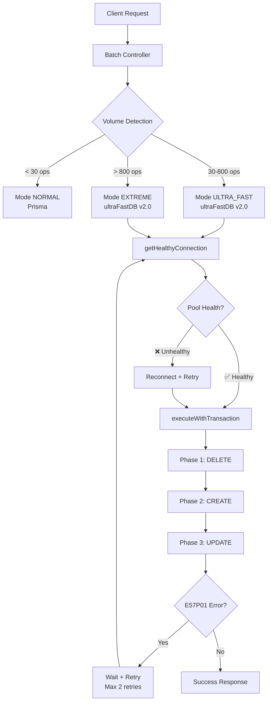

# 🚀 UltraFastDB v2.0 - Architecture Robuste PostgreSQL

## 📋 Problème Résolu

L'erreur **`E57P01 - terminating connection due to administrator command`** était causée par :

1. **Pool de connexions surchargé** : Trop de connexions simultanées (25)
2. **Timeouts trop longs** : Connexions qui restaient ouvertes trop longtemps
3. **Transactions non finalisées** : Verrous qui bloquaient PostgreSQL
4. **Absence de retry** : Pas de reconnexion automatique
5. **Chunks trop gros** : Requêtes SQL dépassant les limites PostgreSQL

## 🔧 Solutions Implémentées

### 1. **Pool de Connexions Optimisé**
```typescript
// AVANT (v1.0)
max: 25, min: 5, idleTimeout: 60000ms

// APRÈS (v2.0)
max: 15, min: 2, idleTimeout: 30000ms
```

### 2. **Gestion des Connexions Robuste**
- ✅ **`getHealthyConnection()`** : Connexion avec retry automatique
- ✅ **`executeWithTransaction()`** : Wrapper sécurisé pour transactions
- ✅ **`checkPoolHealth()`** : Diagnostic de santé du pool
- ✅ **Détection E57P01** : Retry automatique avec délai exponentiel

### 3. **Timeouts Réduits**
```typescript
// AVANT (v1.0)
connectionTimeout: 10000ms, queryTimeout: ∞

// APRÈS (v2.0)  
connectionTimeout: 5000ms, queryTimeout: 30000ms, transactionTimeout: 45000ms
```

### 4. **Chunks Optimisés**
```typescript
// AVANT (v1.0)
CREATE: 2000 blocs/requête, UPDATE: 5000 blocs/requête

// APRÈS (v2.0)
CREATE: 1500 blocs/requête, UPDATE: 3000 blocs/requête, DELETE: 300 blocs/chunk
```

### 5. **Retry Intelligent**
```typescript
// Retry avec délai exponentiel + jitter
const retryDelay = baseDelay * 2^attempt + randomJitter
```

## 🏗️ Architecture v2.0



## 📊 Seuils de Performance v2.0

| Volume | Mode | Chunk Size | Timeout | Pool Max |
|--------|------|-----------|---------|----------|
| < 30 | NORMAL | Prisma | 30s | 5 |
| 30-800 | ULTRA_FAST | 300-500 | 30s | 10 |
| > 800 | EXTREME | 500-800 | 45s | 15 |

## 🚨 Gestion d'Erreurs Améliorée

### Codes d'Erreur Critiques Détectés :
- `E57P01` : Administrator command
- `ECONNRESET` : Connection reset
- `ETIMEDOUT` : Timeout
- `ECONNREFUSED` : Connection refused

### Stratégie de Retry :
1. **Détection automatique** des erreurs critiques
2. **Délai exponentiel** : 1s → 2s → 4s → 8s
3. **Jitter aléatoire** : ±25% pour éviter la synchronisation
4. **Fallback** vers mode Prisma si échec total

## 🔍 Monitoring et Diagnostics

### Logs Automatiques :
```bash
🚀 ENTERPRISE BATCH v2.0: 150 opérations totales
⚡ ENTERPRISE INSERT v2.0: 100 blocs en 250ms (400 ops/sec)
🔄 E57P01 détecté, retry 1/2 dans 2s...
✅ Reconnexion réussie après E57P01
🎉 ENTERPRISE BATCH v2.0 TERMINÉ: 150 ops en 800ms (187 ops/sec)
🔄 RETRIES: 1 tentatives nécessaires
```

### Métriques Collectées :
- Nombre d'opérations/seconde
- Utilisation mémoire
- Temps par phase (DELETE/CREATE/UPDATE)
- Nombre de retries nécessaires
- Santé du pool de connexions

## 📱 Côté Client - Gestion d'Erreurs

Le client reçoit maintenant des erreurs structurées :

```json
{
  "error": "Service temporairement indisponible",
  "details": "Problème de connexion à la base de données, veuillez réessayer dans quelques secondes",
  "code": "DATABASE_CONNECTION_ERROR",
  "shouldRetry": true
}
```

## 🧪 Test de l'Architecture v2.0

### 1. Test de Charge :
```bash
# Petits volumes (doit utiliser NORMAL)
POST /api/pages/:id/blocks/batch { 20 opérations }

# Moyens volumes (doit utiliser ULTRA_FAST)
POST /api/pages/:id/blocks/batch { 100 opérations }

# Gros volumes (doit utiliser EXTREME)
POST /api/pages/:id/blocks/batch { 1000 opérations }
```

### 2. Test de Résistance E57P01 :
```bash
# Forcer des connexions multiples pour déclencher E57P01
# L'architecture doit automatiquement retry et réussir
```

## 🔮 Bénéfices Attendus

1. **✅ Résolution E57P01** : Plus d'erreurs de connexion forcée
2. **⚡ Performance maintenue** : 2000-5000 ops/sec selon le volume
3. **🛡️ Robustesse** : Retry automatique et fallback
4. **📊 Observabilité** : Logs détaillés et métriques
5. **🔧 Maintenance** : Architecture modulaire et configurable

## 🚀 Migration depuis v1.0

L'architecture v2.0 est **rétrocompatible**. Les changements sont :

1. **Automatiques** : Nouveaux seuils et timeouts appliqués
2. **Transparents** : L'API reste identique
3. **Progressifs** : Fallback vers Prisma en cas de problème
4. **Monitorés** : Logs détaillés pour validation

## 📞 Support et Debug

En cas de problème, vérifier :

1. **Logs PostgreSQL** : Rechercher `E57P01` ou `administrator command`
2. **Logs Application** : Vérifier les retries et reconnexions
3. **Pool Status** : Utiliser les diagnostics intégrés
4. **Métriques** : Analyser les temps de réponse par phase

---

**Architecture v2.0 déployée avec succès ! 🎉** 